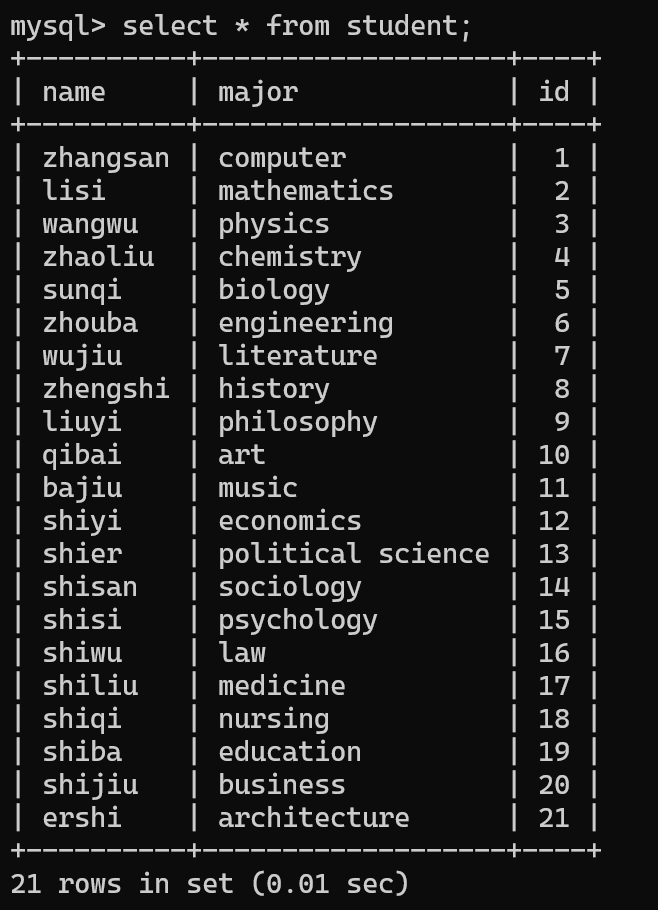
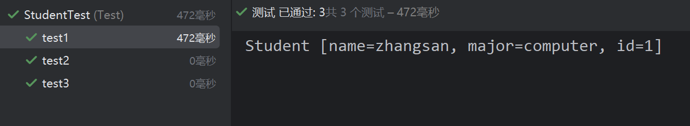

## 1. `<if>`元素

当`<if>`中的`test` 的值为真时就执行加括号里面的语句，否则就不执行。

**示例如下：**

### 数据库准备

```sql
# 切换数据库
use mall;

# 创建数据表
create table customer (
    id int(32) primary key auto_increment comment 'ID',
    name varchar(50) not null comment 'Customer Name',
    address varchar(50) comment 'Customer Address',
    phone varchar(20) comment 'Customer Phone'
);

# 插入数据
insert into customer values(1,'ChengXu','AUST','666666666666');
insert into customer values(2,'Program','AUST','888888888888');
insert into customer values(3,'ProgramCX','AUST','99999999999');

```

### POJO 类准备

在 `org.exmaple.pojo` 下新建一个 `Customer` 类，代码如下：

```java
package org.example.pojo;  

public class Customer {  
    private int id;  
    private String name;  
    private String address;  
    private String phone;  

    public int getId() {  
        return id;  
    }  

    public void setId(int id) {  
        this.id = id;  
    }  

    public String getName() {  
        return name;  
    }  

    public void setName(String name) {  
        this.name = name;  
    }  

    public String getAddress() {  
        return address;  
    }  

    public void setAddress(String address) {  
        this.address = address;  
    }  

    public String getPhone() {  
        return phone;  
    }  

    public void setPhone(String phone) {  
        this.phone = phone;  
    }  

    @Override  
    public String toString() {  
        return "Customer{" +  
                "id=" + id +  
                ", name='" + name + '\'' +  
                ", address='" + address + '\'' +  
                ", phone='" + phone + '\'' +  
                '}';  
    }  
}
```

### 创建映射文件

```xml
<?xml version="1.0" encoding="UTF-8" ?>  
<!DOCTYPE mapper PUBLIC "-//mybatis.org//DTD Mapper 3.0//EN"  
        "http://mybatis.org/dtd/mybatis-3-mapper.dtd">  
<mapper namespace="org.example.pojo.Customer">  
    <select id="queryCustomerByNameAndAddress"  
            parameterType="org.example.pojo.Customer"  
            resultType="org.example.pojo.Customer">  
        SELECT * from customer where 1=1  
        <if test="name !=null and name !=''">  
            and name=#{name}  
        </if>  
        <if test="phone !=null and phone!=''">  
            and phone=#{phone}  
        </if>  
    </select>  

</mapper>
```

### 修改核心配置文件

```xml
<?xml version="1.0" encoding="UTF-8" ?>  
<!DOCTYPE configuration  
        PUBLIC "-//mybatis.org//DTD Config 3.0//EN"  
        "http://mybatis.org/dtd/mybatis-3-config.dtd">  
<!-- 配置文件的根元素 -->  
<configuration>  
    <!-- 属性：定义配置外在化 -->  
    <properties resource="db.properties"/>  
    <!-- 环境：配置mybatis的环境 -->  
    <environments default="development">  
        <!-- 环境变量：可以配置多个环境变量，比如使用多数据源时，就需要配置多个环境变量 -->  
        <environment id="development">  
            <!-- 事务管理器 -->  
            <transactionManager type="JDBC"/>  
            <!-- 数据源 -->  
            <dataSource type="POOLED">  
                <property name="driver" value="${mysql.driver}"/>  
                <property name="url" value="${mysql.url}"/>  
                <property name="username" value="${mysql.username}"/>  
                <property name="password" value="${mysql.password}"/>  
            </dataSource>        
        </environment>    
    </environments>    
    <mappers>       
        <mapper resource="mapper/UserMapper.xml"/>  
        <mapper resource="mapper/CustomMapper.xml"/>  
    </mappers>
</configuration>
```

### 创建测试类

```java
package Test;  

import org.apache.ibatis.io.Resources;  
import org.apache.ibatis.session.SqlSession;  
import org.apache.ibatis.session.SqlSessionFactory;  
import org.apache.ibatis.session.SqlSessionFactoryBuilder;  
import org.junit.Test;  

import java.io.IOException;  
import java.io.Reader;  

import org.example.pojo.Customer;  
public class CustomerTest {  

    @Test  
    public void test() throws IOException {  
        //初始化配置  
        Reader read = Resources.getResourceAsReader("mybatis-config.xml");  
        SqlSessionFactory sqlSessionFactory = new SqlSessionFactoryBuilder().build(read);  
        SqlSession sqlSession = sqlSessionFactory.openSession();  

        //创建POJO类的实例  
        Customer customer = new Customer();  
        customer.setId(1);  
        customer.setAddress("AUST");  
        customer.setPhone("666666666666");  

        customer = sqlSession.selectOne("queryCustomerByNameAndAddress", customer);  
        System.out.println(customer);  
    }  
}
```

### 运行结果

```bash
"D:\Program Files\Java\jdk-23\bin\java.exe" -ea -Didea.test.cyclic.buffer.size=1048576 "-javaagent:D:\Program Files\JetBrains\IntelliJ IDEA 2024.3.1.1\lib\idea_rt.jar=50887:D:\Program Files\JetBrains\IntelliJ IDEA 2024.3.1.1\bin" -javaagent:C:\Users\Progr\AppData\Local\JetBrains\IntelliJIdea2024.3\captureAgent\debugger-agent.jar -Dkotlinx.coroutines.debug.enable.creation.stack.trace=false -Ddebugger.agent.enable.coroutines=true -Dkotlinx.coroutines.debug.enable.flows.stack.trace=true -Dkotlinx.coroutines.debug.enable.mutable.state.flows.stack.trace=true -Dfile.encoding=UTF-8 -Dsun.stdout.encoding=UTF-8 -Dsun.stderr.encoding=UTF-8 -classpath "D:\Program Files\JetBrains\IntelliJ IDEA 2024.3.1.1\lib\idea_rt.jar;D:\Program Files\JetBrains\IntelliJ IDEA 2024.3.1.1\plugins\junit\lib\junit5-rt.jar;D:\Program Files\JetBrains\IntelliJ IDEA 2024.3.1.1\plugins\junit\lib\junit-rt.jar;C:\Users\Progr\IdeaProjects\untitled\target\test-classes;C:\Users\Progr\IdeaProjects\untitled\target\classes;D:\Program Files\apache-maven-3.9.9\repository\org\mybatis\mybatis\3.5.19\mybatis-3.5.19.jar;D:\Program Files\apache-maven-3.9.9\repository\com\mysql\mysql-connector-j\8.0.33\mysql-connector-j-8.0.33.jar;D:\Program Files\apache-maven-3.9.9\repository\com\google\protobuf\protobuf-java\3.21.9\protobuf-java-3.21.9.jar;D:\Program Files\apache-maven-3.9.9\repository\junit\junit\4.13.2\junit-4.13.2.jar;D:\Program Files\apache-maven-3.9.9\repository\org\hamcrest\hamcrest-core\1.3\hamcrest-core-1.3.jar" com.intellij.rt.junit.JUnitStarter -ideVersion5 -junit4 Test.CustomerTest,test
Customer{id=1, name='ChengXu', address='AUST', phone='666666666666'}

进程已结束，退出代码为 0
```

### 代码分析

```xml
<select id="queryCustomerByNameAndAddress"  
            parameterType="org.example.pojo.Customer"  
            resultType="org.example.pojo.Customer">  
        SELECT * from customer where 1=1  
        <if test="name !=null and name !=''">  
            and name=#{name}  
        </if>  
        <if test="phone !=null and phone!=''">  
            and phone=#{phone}  
        </if>  
</select>  
```

这段代码接受一个`Customer`类作为参数主要对`where`部分进行了条件判断，当 `Customer.name`存在时进行`name`筛选，当Customer.phone存在时进行`phone`筛选。

## 2. `<choose>`、`<when>`、`<otherwise>`元素

使用`<if>`元素时，可以选择多个元素进行执行；如果需要选择单个元素，用`<if>`是不合适的，此时应该使用`<when>`，`<when>`只能选择单个元素进行执行。有点类似于`switch...case...default...`语句。

- **choose**: 类似于`switch`。
- **when**: 类似于`case`。
- **otherwise**: 类似于`default`。

**基本格式**:

```xml
<choose>
    <when test="...">
        <!--SQL 语句-->
    </when>
    <when test="...">
        <!--SQL 语句-->
    </when>
    <when test="...">
        <!--SQL 语句-->
    </when>
    <when test="...">
        <!--SQL 语句-->
    </when>
    <otherwise>
        <!--SQL 语句-->
    </otherwise>
</choose>
```

## 3. `<where>`和`<trim>`

### 3.1 `<where>`

之前我们在使用`<if>`元素时，会在`where`后面加上`1=1`来确保即使后面条件判断不成立这个 SQL 语句没有语法错误，能够执行`<where>`可以替代`1=1`,只要在`<if>`元素外边包裹一层`<where>`就可以了，这样既符合逻辑，又清晰明了。

### 3.2 `<trim>`

除了可以使用`<where>`来实现之外，还可以使用`<trim>`来实现这个功能，**`<trim>`用来删除多余的关键字**。

下面是`<trim>`元素的属性：

- **prefix**：指定给SQL语句增加的前缀；
- prefixOverrides：指定要给SQL语句中去掉的前缀字符串；
- suffix：指定要给SQL语句增加的后缀；
- suffixOverrides：指定要给SQL语句中去掉都后缀字符串。

## 4. 更新操作

在实际开发中，一般我们只想更新某个对象的某个或多个字段，如果像传统的`Hibernate`框架，就必须发送所有的字段给持久化对象，这个会导致执行效率非常低。而`MyBatis`给出了`<set>`元素，和`<if>`元素结合可以实现更新需要更新字段的目的。

格式为：

```xml
update ...
<set>
    <if test="...">
        ...
    </if>
    <if test="...">
        ...
    </if>
</set>
```

## 5. 复杂查询操作

### 5.1 `<foreach>`元素的属性

#### 5.1.2 迭代数组

假如有一个数据表，结构如下：

```sql
CREATE TABLE users (
    id INT PRIMARY KEY,
    name VARCHAR(50)
);
```

我们要根据一个id数组来查询多个用户的名字，映射文件可以这样配置：

```xml
<select id="findUsersByIds" parameterType="int[]" resultType="User">
    SELECT * FROM users
    WHERE id IN
    <foreach collection="array" item="id" open="(" separator="," close=")">
        #{id}
    </foreach>
</select>
```

如果我们这样调用：

```java
    int[] ids = [1,2,3];
    List<User> users = userMapper.findUsersByIds(ids);
```

会生成下列语句：

```sql
SELECT * FROM users WHERE id IN (1, 2, 3);
```

**这个`id IN (1, 2, 3)`语句其实就是`id=1 OR id=2 OR id=3`的简写。**

根据所学知识，上述映射文件代码就等价于：

```xml
<select id="findUsersByIds" parameterType="int[]" resultType="User">
    SELECT * FROM users
    WHERE 
    <where>
        <foreach collection="array" item="id" separator="OR">
            <if test="id != null and id != ''">
                id = #{id}
            </if>
        </foreach>
    </where>
</select>
```

#### 5.1.3 迭代List

使用方法类似于Array，只是把传入参数改成List。

映射文件可以这样配置：

```xml
<select id="findUsersByIds" parameterType="java.util.Arrays" resultType="User">
    SELECT * FROM users
    WHERE id IN
    <foreach collection="array" item="id" open="(" separator="," close=")">
        #{id}
    </foreach>
</select>
```

调用方法：

```java
List<Integer> ids = new  ArrayList<Integer>();
ids.add(1);
ids.add(2);
List<User> users = userMapper.findUsersByIds(ids);
```

#### 5.1.3 迭代 Map

通过指定多个限定条件来查询符合条件的用户(`AND`)，可以使用Map。

通过id和姓名来查询用户：

```xml
<select id="findUsersByParams" parameterType="java.util.Map" resultType="User">
    SELECT * FROM users
    WHERE
    <where>
        <if test="ids != null and ids.size() > 0">
            id IN
            <foreach collection="ids" item="id" open="(" separator="," close=")">
                #{id}
            </foreach>
        </if>

        <if test="name != null and name != ''">
            AND name = #{name}
        </if>
    </where>
</select>
```

其中，里面的ids就是传入的Map对象的ids键所对应的值（是一个数组），然后通过``<foreach>``遍历获取每一个id，ids就是传入的Map对象的ids键所对应的值。

```java
Map<String, Object> params = new HashMap<>();
params.put("ids", Arrays.asList(1, 2, 3));  // 传入 ids 数组
params.put("name", "Alice");  // 传入 name

List<User> users = userMapper.findUsersByParams(params);
```

就会生成这个sql语句：

```sql
select * from user where id in (1,2,3) AND name="Alice";
```

## 实践：学生信息查询系统

**利用本章属于知识完成一个学生信息查询系统。该系统要求实现以下三个功能：**

- 当用户输入的学生姓名不为空时，则只根据学生姓名进行学生信息的查询。
- 当用户输入的学生姓名为空，而学生专业为空时，则指根据学生专业进行学生信息的查询。
- 当用户输入的学生姓名和专业都为空，则要求查询出所有学号不为空的学生信息。

### 第一步：数据库数据准备

登录 MySQL 终端，输入以下代码：

```sql
use mall;

create table student(

    name varchar(50), # 学生姓名

    major varchar(256), # 专业

    id int primary key auto_increment # 学生编号

);


create index idx_student_id on student(id); # 为学生编号创建索引


# 插入数据

insert into student(name, major) values('zhangsan', 'computer');

insert into student(name, major) values('lisi', 'mathematics');

insert into student(name, major) values('wangwu', 'physics');

insert into student(name, major) values('zhaoliu', 'chemistry');

insert into student(name, major) values('sunqi', 'biology');

insert into student(name, major) values('zhouba', 'engineering');

insert into student(name, major) values('wujiu', 'literature');

insert into student(name, major) values('zhengshi', 'history');

insert into student(name, major) values('liuyi', 'philosophy');

insert into student(name, major) values('qibai', 'art');

insert into student(name, major) values('bajiu', 'music');

insert into student(name, major) values('shiyi', 'economics');

insert into student(name, major) values('shier', 'political science');

insert into student(name, major) values('shisan', 'sociology');

insert into student(name, major) values('shisi', 'psychology');

insert into student(name, major) values('shiwu', 'law');

insert into student(name, major) values('shiliu', 'medicine');

insert into student(name, major) values('shiqi', 'nursing');

insert into student(name, major) values('shiba', 'education');

insert into student(name, major) values('shijiu', 'business');

insert into student(name, major) values('ershi', 'architecture');
```

 

### 第二步：创建 POJO 类

在`org.example.pojo`包下新建一个`Student.java`文件，创建 POJO 类 Student

```java
package Test;  

import org.apache.ibatis.io.Resources;  
import org.apache.ibatis.session.SqlSession;  
import org.apache.ibatis.session.SqlSessionFactory;  
import org.apache.ibatis.session.SqlSessionFactoryBuilder;  
import org.example.pojo.Student;  
import org.junit.Test;  

import java.io.IOException;  
import java.io.Reader;  
import java.util.List;  

public class StudentTest {  
    private static SqlSession sqlSession;  
    @Test  
    public void test1() throws IOException {  
        Student student = new Student();  
        student.setName("zhangsan");  
        SqlSession session=getSession();  
        List<Student> list=session.selectList("findStudent",student);  
        for(Student s:list){  
            System.out.println(s);  
        }  
    }  

    @Test  
    public void test2() throws IOException {  
        Student student = new Student();  
        student.setMajor("economics");  
        SqlSession session=getSession();  
        List<Student> list=session.selectList("findStudent",student);  
        for(Student s:list){  
            System.out.println(s);  
        }  
    }  

    @Test  
    public void test3() throws IOException {  
        Student student = new Student();  
        sqlSession=getSession();  
        List<Student> list=sqlSession.selectList("findStudent",student);  
        for(Student s:list){  
            System.out.println(s);  
        }  
    }  

    public static SqlSession getSession() throws IOException {  
        if(sqlSession == null){  
            Reader reader = Resources.getResourceAsReader("mybatis-config.xml");  
            SqlSessionFactory sqlSessionFactory = new SqlSessionFactoryBuilder().build(reader);  
            sqlSession = sqlSessionFactory.openSession();  
        }  
        return sqlSession;  
    }  
}
```


### 第三步：Mapper 映射文件配置

创建 StudentMapper，创建映射关系和查询条件：

```xml
<?xml version="1.0" encoding="UTF-8" ?>  
<!DOCTYPE mapper PUBLIC "-//mybatis.org//DTD Mapper 3.0//EN"  
        "http://mybatis.org/dtd/mybatis-3-mapper.dtd">  
<mapper namespace="org.example.pojo.Student">  
    <select id="findStudent" parameterType="org.example.pojo.Student" resultType="org.example.pojo.Student">  
        select * from student  
        <where>  
            <!--当用户输入的学生姓名不为空时，则只根据学生姓名进行学生信息的查询。-->  
            <if test="name!=null and name!=''">  
                name=#{name}  
            </if>  

            <!--当用户输入的学生姓名为空，而学生专业为空时，则指根据学生专业进行学生信息的查询。-->  
            <if test="(name==null or name=='') and (major!='' and major!=null)">  
                major=#{major}  
            </if>  

            <!--当用户输入的学生姓名和专业都为空，则要求查询出所有学号不为空的学生信息。-->  
            <if test="(name==null or name=='') and (major=='' or major==null)">  
                id!=0  
            </if>  
        </where>  
    </select>  
</mapper>
```

### 第四步：配置 MyBatis 配置文件

在mybatis-config.xml 里，把 StudentMapper.xml 文件包含进去：

```xml
<mapper resource="mapper/StudentMapper.xml"/>
```

### 第五步：创建测试类

在 test/java/Test 目录下创建 StudentTest.java 文件，添加以下测试方法：

```java
package Test;  

import org.apache.ibatis.io.Resources;  
import org.apache.ibatis.session.SqlSession;  
import org.apache.ibatis.session.SqlSessionFactory;  
import org.apache.ibatis.session.SqlSessionFactoryBuilder;  
import org.example.pojo.Student;  
import org.junit.Test;  

import java.io.IOException;  
import java.io.Reader;  
import java.util.List;  

public class StudentTest {  
    private static SqlSession sqlSession;  
    @Test  
    //当用户输入的学生姓名不为空时，则只根据学生姓名进行学生信息的查询。  
    public void test1() throws IOException {  
        Student student = new Student();  
        student.setName("zhangsan");  
        SqlSession session=getSession();  
        List<Student> list=session.selectList("findStudent",student);  
        for(Student s:list){  
            System.out.println(s);  
        }  
    }  

    @Test  
    //当用户输入的学生姓名为空，而学生专业为空时，则指根据学生专业进行学生信息的查询。  
    public void test2() throws IOException {  
        Student student = new Student();  
        student.setMajor("economics");  
        SqlSession session=getSession();  
        List<Student> list=session.selectList("findStudent",student);  
        for(Student s:list){  
            System.out.println(s);  
        }  
    }  

    @Test  
    //当用户输入的学生姓名和专业都为空，则要求查询出所有学号不为空的学生信息。  
    public void test3() throws IOException {  
        Student student = new Student();  
        sqlSession=getSession();  
        List<Student> list=sqlSession.selectList("findStudent",student);  
        for(Student s:list){  
            System.out.println(s);  
        }  
    }  

    public static SqlSession getSession() throws IOException {  
        if(sqlSession == null){  
            Reader reader = Resources.getResourceAsReader("mybatis-config.xml");  
            SqlSessionFactory sqlSessionFactory = new SqlSessionFactoryBuilder().build(reader);  
            sqlSession = sqlSessionFactory.openSession();  
        }  
        return sqlSession;  
    }  
}
```

### 第五步：查看运行结果😆



**成功了，这一章学习圆满结束！🎆🎆**

输出结果如下：

- **test1：**
  
  ```
  Student [name=zhangsan, major=computer, id=1]
  ```

- **test2：**
  
  ```
  Student [name=shiyi, major=economics, id=12]
  ```

- **test3：**
  
  ```
  Student [name=zhangsan, major=computer, id=1]
  Student [name=lisi, major=mathematics, id=2]
  Student [name=wangwu, major=physics, id=3]
  Student [name=zhaoliu, major=chemistry, id=4]
  Student [name=sunqi, major=biology, id=5]
  Student [name=zhouba, major=engineering, id=6]
  Student [name=wujiu, major=literature, id=7]
  Student [name=zhengshi, major=history, id=8]
  Student [name=liuyi, major=philosophy, id=9]
  Student [name=qibai, major=art, id=10]
  Student [name=bajiu, major=music, id=11]
  Student [name=shiyi, major=economics, id=12]
  Student [name=shier, major=political science, id=13]
  Student [name=shisan, major=sociology, id=14]
  Student [name=shisi, major=psychology, id=15]
  Student [name=shiwu, major=law, id=16]
  Student [name=shiliu, major=medicine, id=17]
  Student [name=shiqi, major=nursing, id=18]
  Student [name=shiba, major=education, id=19]
  Student [name=shijiu, major=business, id=20]
  Student [name=ershi, major=architecture, id=21]
  ```
