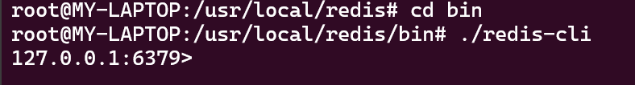
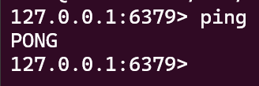

# Redis 基础

## 1. Redis 简介

Redis 是一个开源的使用 ANSI C 语言编写、支持网络、可基于内存亦可持久化的日志型、Key-Value 数据库，并提供多种语言的 API。

## 2. Redis 安装

### 2.1 下载

- Linux 安装：

#### 2.1.1 安装依赖

```shell
sudo apt update # 更新软件包
sudo apt install pkg-config # 安装 pkg-config
sudo apt install libjemalloc-dev # 安装jemalloc
sudo apt install gcc # 安装gcc
sudo apt install g++ # 安装g++
```
#### 2.1.2 下载 Redis

```shell
wget http://download.redis.io/redis-stable.tar.gz
tar xzf redis-stable.tar.gz
cd redis-stable
make PREFIX=/usr/local/redis install
```
等待安装完成

## 2.2 启动 Redis

```shell
cd /usr/local/redis/bin
./redis-server
```

## 2.3 连接 Redis

```shell
./redis-cli
```
会显示如下页面：



此时我们输入 `ping` 命令，会返回 `PONG`，表示连接成功。



## 3. Redis 基本操作

### 3.1 热身
#### 3.1.1 获取符合条件的所有 key
```shell
keys *
```
**glob 风格匹配规则：**
- `*` 匹配任意数量的字符
- `?` 匹配一个字符
- `[]` 匹配括号内的任意一个字符
- `[-]` 匹配括号内的任意一个字符范围
- `\x` 转义字符，匹配 x 字符

#### 3.1.2 判断 key 是否存在
我们先创建一个·名叫 `bar` 的 key，然后判断它是否存在：
```shell
set bar 1
```

判断是否存在：
```shell
exists bar
```
如果存在，返回 `1`，否则返回 `0`。

#### 3.1.3 删除 key
```shell
del bar
```

#### 3.1.4 获取 key 的类型
```shell
set foo 1
type foo # 返回 string
```

### 3.2 字符串
#### 3.2.1 设置 key 的值
set 和 get 命令用于设置和获取 key 的值：
```shell
set key hello
get key # 返回 hello
```
#### 3.2.2 递增数字
```shell
set counter 100
incr counter # 返回 101
```
**当 key 不存在时，incr 命令会将 key 的值设置为 0，然后再执行递增操作。**

#### 3.2.3 递减数字
```shell
decr counter # 返回 100
```

#### 3.2.4 增加指定浮点数
```shell
set float 10.5
incrbyfloat float 0.1 # 返回 10.6
```

#### 3.2.5 获取 key 的长度
```shell
set key hello
strlen key # 返回 5
```

#### 3.2.6 同时设置/获取多个 key
```shell
mset key1 hello key2 world # 设置 key1 和 key2 的值
mget key1 key2 # 获取 key1 和 key2 的值
```

### 3.3 位操作

**优点：**
位操作命令可以非常紧凑地存储布尔值，节省内存，而且读取速度非常快。

**语法:**
```shell
setbit key offset value
getbit key offset
bitcount key [start end]
bitop operation destkey key1 [key2 ...]
bitpos key bit [start end]
```

#### 3.3.1 设置指定偏移量的位值
```shell
setbit bit 7 1
```
**注意：**
- offset 从 0 开始

#### 3.3.2 获取指定偏移量的位值
```shell
getbit bit 7 # 返回 1
```

#### 3.3.3 统计指定范围内的位值为 1 的个数
```shell
setbit bit 7 1

bitcount bit 0 0 # 返回 1
```

#### 3.3.4 对一个或多个 key 进行位运算，并将结果保存到 destkey
```shell
setbit key1 7 1
setbit key2 7 1

bitop AND dest key1 key2
```

#### 3.3.5 查找第一个设置为 1 或 0 的位
```shell
setbit key 7 1
setbit key 15 1

bitpos key 1 # 返回 7
```

### 3.3 哈希类型
哈希类型是一个键值对集合，适合存储对象。

**语法:**
```shell
hset key field value # 设置 key 的 field 字段的值为 value
hget key field # 获取 key 的 field 字段的值
hmset key field1 value1 field2 value2 # 设置多个 field 的值

hgetall key # 获取 key 的所有 field 和 value
```

#### 3.3.1 设置哈希值
```shell
hset user name tom
hset user age 20
```

#### 3.3.2 获取哈希值
```shell
hget user name # 返回 tom
```

#### 3.3.3 设置多个哈希值
```shell

hmset user name tom age 20
```

#### 3.3.4 获取所有哈希值
```shell

hgetall user # 返回 name tom age 20
```

#### 3.3.5 判断字段是否存在
```shell
hexists user name # 返回 1
```

#### 3.3.6 当字段不存在时设置值
```shell
hsetnx user name tom # 如果 name 字段不存在，则设置值
```

#### 3.3.7 增加数字
```shell

hincrby user age 1 # 将 age 字段的值增加 1
```

#### 3.3.8 删除字段
```shell
hdel user name # 删除 name 字段
```

### 3.4 列表类型
列表类型是一个有序的字符串链表。

#### 3.4.1 插入元素
```shell
lpush list 1 2 3 4 5 # 从左边插入元素
```

```shell
rpush list 1 2 3 4 5 # 从右边插入元素
```

#### 3.4.2 弹出元素
redis 执行弹出元素操作时会先将需要弹出的值删除，然后返回这个值。

```shell
lpop list # 从左边弹出元素
```

```shell
rpop list # 从右边弹出元素
```

#### 3.4.3 获取列表中元素的个数

```shell
llen list # 返回列表中元素的个数
```

#### 3.4.4 获取列表中指定范围的元素

**语法:**
```shell
lrange key [start] [end]
```

```shell
lrange list 0 -1 # 返回列表中所有元素
```

#### 3.4.5 删除列表中的元素

```shell
lrem list 1 2 # 删除列表中第一个值为 2 的元素
```

#### 3.4.6 设置列表中指定索引的值

```shell

lset list 0 100 # 将列表中索引为 0 的值设置为 100
```

### 3.5 集合类型
集合类型是一个无序的字符串集合。

#### 3.5.1 添加/删除元素
```shell
sadd set 1 2 3 4 5 # 添加元素
```

```shell
srem set 1 # 删除元素
```

#### 3.5.2 获取集合中元素的个数
```shell

scard set # 返回集合中元素的个数
```

#### 3.5.3 获取集合中所有元素
```shell

smembers set # 返回集合中所有元素
```

#### 3.5.4 判断元素是否存在
```shell

sismember set 1 # 判断 1 是否在集合中
```

#### 3.5.5 随机获取元素
```shell

srandmember set # 随机获取一个元素
```

#### 3.5.6 随机删除元素
```shell

spop set # 随机删除一个元素
```

#### 3.5.7 求交集
```shell

sadd set1 1 2 3 4 5

sadd set2 3 4 5 6 7

sinter set1 set2 # 返回 3 4 5
```

#### 3.5.8 求并集
```shell

sunion set1 set2 # 返回 1 2 3 4 5 6 7
```

#### 3.5.9 求差集
```shell

sadd set1 1 2 3 4 5

sadd set2 3 4 5 6 7

sdiff set1 set2 # 返回 1 2
```

### 3.6 有序集合类型

有序集合类型是一个字符串成员与浮点数分值之间的映射。

#### 3.6.1 添加元素
```shell

zadd zset 1 tom 2 jerry 3 alice # 添加元素
```

#### 3.6.2 获取元素的分值
```shell

zscore zset tom # 获取 tom 的分值
```

#### 3.6.3 获取元素的排名
```shell

zrank zset tom # 获取 tom 的排名
```

#### 3.6.4 获取指定范围内的元素
```shell

zrange zset 0 -1 # 获取所有元素
```

#### 3.6.5 删除元素
```shell

zrem zset tom # 删除 tom
```

#### 3.6.6 获取元素的个数
```shell

zcard zset # 获取元素的个数
```

#### 3.6.7 获取指定分值
```shell

zcount zset 1 2 # 获取分值在 1 和 2 之间的元素个数
```

#### 3.6.8 获取指定范围内的元素
```shell

zrangebyscore zset 1 2 # 获取分值在 1 和 2 之间的元素
```


