# JPA 在Spring Boot中的基本使用

## 1. 添加依赖

```xml
<dependency>
    <groupId>org.springframework.boot</groupId>
    <artifactId>spring-boot-starter-data-jpa</artifactId>
</dependency>
```

## 2. 配置数据源

```yaml
spring:
  datasource:
    url: jdbc:mysql://localhost:3306/init?useUnicode=true&characterEncoding=utf-8&useSSL=false&serverTimezone=GMT%2B8
    username: root
    password: mysql
```

## 3.常用注解

- `@Entity`：声明一个实体类
- `@Table`：指定实体类对应的表
    1. `name`：指定表名
    2. `catalog`：指定数据库名
    3. `schema`：指定数据库模式
    4. `uniqueConstraints`：指定表的唯一约束
    5. `indexes`：指定表的索引
- `@Id`：声明一个实体类的主键，一个实体只能有一个属性被映射为主键
- `@GeneratedValue`：指定主键的生成策略
    1. `AUTO`：自动选择合适的策略, 默认值
    2. `IDENTITY`：数据库自增
    3. `SEQUENCE`：数据库序列
    4. `TABLE`：数据库表
    > 默认为`AUTO`
- `@Column`：指定实体类属性与数据库表字段的映射关系
    1. `name`：指定字段名
    2. `nullable`：是否允许为空
    3. `unique`：是否唯一
    4. `length`：字段长度
    5. `precision`：精度
    6. `scale`：小数位数
    7. `insertable`：是否插入
    8. `updatable`：是否更新
    9. `columnDefinition`：字段定义
- `@Transient`：声明一个实体类属性不与数据库表字段映射
- `@OneToMany`：一对多关联
    1. `targetEntity`：目标实体类
    2. `mappedBy`：指定关联的属性
    3. `cascade`：级联操作
    4. `fetch`：加载策略
- `@ManyToOne`：多对一关联
    1. `targetEntity`：目标实体类
    2. `cascade`：级联操作
    3. `fetch`：加载策略
- `@ManyToMany`：多对多关联
    1. `targetEntity`：目标实体类
    2. `mappedBy`：指定关联的属性
    3. `cascade`：级联操作
    4. `fetch`：加载策略
- `@OneToOne`：一对一关联
    1. `targetEntity`：目标实体类
    2. `mappedBy`：指定关联的属性
    3. `cascade`：级联操作
    4. `fetch`：加载策略
    5. `optional`：是否可选
- `@JoinColumns`：指定多个外键列
    1. `@JoinColumn`：指定外键列
    2. `name`：指定外键列名
    3. `referencedColumnName`：指定参考列名
    4. `nullable`：是否允许为空
    5. `unique`：是否唯一
    6. `insertable`：是否插入
    7. `updatable`：是否更新
- `@JoinColumn`：指定外键列
    1. `name`：指定外键列名
    2. `referencedColumnName`：指定参考列名
    3. `nullable`：是否允许为空
    4. `unique`：是否唯一
    5. `insertable`：是否插入
    6. `updatable`：是否更新
- `@JoinTable`：指定中间表
    1. `name`：指定中间表名
    2. `joinColumns`：指定当前表的外键列
    3. `inverseJoinColumns`：指定目标表的外键列
- `@OrderBy`：指定排序
    1. `value`：排序字段
    2. `asc`：是否升序
- `@Query`：自定义查询
    1. `value`：查询语句
    2. `nativeQuery`：是否使用原生SQL
    3. `countQuery`：查询总数
    4. `name`：查询名称
    5. `hints`：查询提示
- `@PrePersist`：保存前执行

**解释：**

### 多对一查询（@ManyToOne）

**在多对一查询中，我们一般使用 @ManyToOne 注解，让“多”的一方存储外键，指向“单个”的一方。比如，消息表 (tb_messages) 里的 senderUserId 作为外键，指向用户表 (tb_users) 的 id。**

@ManyToOne 注解中，我们可以：

- 使用 targetEntity 指定目标实体类。

- 使用 cascade 指定级联操作。

- 使用 fetch 指定加载策略。

- 配合 @JoinColumn 注解，指定外键字段及相关属性：

  - name：指定外键列名（不是外键对应的键的列名）。

  - referencedColumnName：指定参考列名（即目标表的主键）。

  - nullable：是否允许为空。

  - unique：是否唯一。

  - insertable：是否允许插入。

  - updatable：是否允许更新。

### 一对多查询（@OneToMany）

在一对多查询中，我们一般使用 @OneToMany 注解，表示一个实体类可以对应多个子实体。**数据库不会创建外键列，而是通过 "多" 的一方的 @ManyToOne 维护关系。**例如：

```java
@OneToMany(mappedBy = "user", cascade = CascadeType.ALL, fetch = FetchType.LAZY)
private List<Messages> messages;
```
**上述代码写在要被映射到的POJO类中，表示这个类有一个 List 类型的 messages 属性，这个属性是一个一对多关系。**

- mappedBy = "user"：必须指定，表示这个关系是由 Messages 实体的 user 维护的。

- cascade：可以指定级联操作，如 CascadeType.ALL 代表级联新增、删除、更新。

- fetch：

   - FetchType.LAZY（默认）：懒加载，只有访问 messages 时才查询数据库。

   - FetchType.EAGER：立即加载，查询 Users 时会一并查询 messages。

### 多对多查询（@ManyToMany）

在多对多查询中，我们一般使用 @ManyToMany 注解，表示两个实体类之间有多对多关系。**数据库会创建中间表，中间表存储两个实体类的主键。**例如：

```java
@ManyToMany
@JoinTable(name = "tb_user_to_user", joinColumns = @JoinColumn(name = "userId_1"), inverseJoinColumns = @JoinColumn(name = "userId_2"))
private List<Users> users;
```
**上述代码写在要被映射到的POJO类中，表示这个类有一个 List 类型的 users 属性，这个属性是一个多对多关系。**

- @JoinTable：指定中间表。

  - name：指定中间表名。

  - joinColumns：指定当前表的外键列。

  - inverseJoinColumns：指定目标表的外键列。

### 一对一查询（@OneToOne）

在一对一查询中，我们一般使用 @OneToOne 注解，表示两个实体类之间有一对一关系。**数据库会创建外键列，外键列存储两个实体类的主键。**例如：

```java

@OneToOne
@JoinColumn(name = "userToUserId", nullable = false)
private UserToUser userToUser;

```
**上述代码写在要被映射到的POJO类中，表示这个类有一个 UserToUser 类型的 userToUser 属性，这个属性是一个一对一关系。**

- @JoinColumn：指定外键列。

  - name：指定外键列名。

  - referencedColumnName：指定参考列名。

  - nullable：是否允许为空。

  - unique：是否唯一。

  - insertable：是否允许插入。此属性在我们不希望JPA操作这个字段时，可以设置为false。

  - updatable：是否允许更新。此属性在我们不希望JPA操作这个字段时，可以设置为false。

- optional：是否可选。

## 4.简单增删改查
随便创建一个数据库，命名为`init`，创建一个表`new`，表结构如下：


### 4.1 创建实体类

```java
package cn.programcx.springbootinit.model;

import javax.persistence.*;

@Entity
@Table(name = "new")
public class Newer {
    @Id
    @Column(name = "id")
    @GeneratedValue(strategy = GenerationType.IDENTITY)
    private int id;

    @Column(name = "name")
    private String name;

    public Newer(int id, String name) {
        this.id = id;
        this.name = name;
    }

    public int getId() {
        return id;
    }

    public void setId(int id) {
        this.id = id;
    }

    public String getName() {
        return name;
    }

    public void setName(String name) {
        this.name = name;
    }

    public Newer() {

    }
    @Override
    public String toString() {
        return "Newers{" +
                "id=" + id +
                ", name='" + name + '\'' +
                '}';
    }

}

```
注解解释：
- `@Entity`：声明一个实体类，比如`Newer`就是一个实体类
- `@Table`：指定实体类对应的表，比如`Newer`对应的表是`new`
- `@Id`：声明一个实体类的主键，一个实体只能有一个属性被映射为主键
- `@GeneratedValue`：指定主键的生成策略，这里使用`IDENTITY`，即数据库自增。我们用的是MySQL数据库，所以是`IDENTITY`，如果是Oracle数据库，就是`SEQUENCE`。
- `@Column`：指定实体类属性与数据库表字段的映射关系，比如`id`对应的字段是`id`，`name`对应的字段是`name`

### 4.2 创建Repository

我们需要使用一个类来操作数据库，这个类就是`NewerDao`，我们需要创建一个`NewerDao`接口，继承`JpaRepository`接口，`JpaRepository`接口有很多方法，比如`save`、`delete`、`findAll`等等，我们可以直接使用这些方法，也可以自定义方法。
```java
package cn.programcx.springbootinit.dao;

import cn.programcx.springbootinit.model.Newer;

import org.springframework.data.jpa.repository.JpaRepository;

public interface NewerDao extends JpaRepository<Newer, Integer> {
}

```

### 4.3 **增**

我们在进行每一次操作之前，都需要先创建一个`Newer`对象，然后再进行操作。操作结束后，我们需要调用`save`方法，将对象保存到数据库中。

创建一个测试类，测试增加操作。
```java
package cn.programcx.springbootinit;

import cn.programcx.springbootinit.dao.NewerDao;
import cn.programcx.springbootinit.model.Newer;
import org.junit.jupiter.api.Test;
import org.springframework.beans.factory.annotation.Autowired;
import org.springframework.boot.test.context.SpringBootTest;

import org.springframework.jdbc.core.JdbcTemplate;

@SpringBootTest(webEnvironment = SpringBootTest.WebEnvironment.RANDOM_PORT)
class SpringBootInitApplicationTests {
    @Autowired
    JdbcTemplate jdbcTemplate;

    @Autowired
    NewerDao newerDao;

    @Test
    void test() {
        Newer newer = new Newer();
        newer.setName("Program");
        newerDao.save(newer);   //保存到数据库
    }

}

```

### 4.4 **删**

删除操作和增加操作类似，我们需要先创建一个`Newer`对象，然后再进行操作。操作结束后，我们需要调用`delete`方法，将对象从数据库中删除。

```java
void test() {
    Newer newer = new Newer();
    newer.setId(1);
    newerDao.delete(newer);   //删除
}
```

### 4.5 **改**

修改操作和增加操作类似，我们需要先创建一个`Newer`对象，然后再进行操作。操作结束后，我们需要调用`save`方法，将对象保存到数据库中。

```java

void test() {
    Newer newer = new Newer();
    newer.setId(1);
    newer.setName("ProgramCX");
    newerDao.save(newer);   //修改
}
```

### 4.6 **查**

查询操作和增加操作类似，我们需要先创建一个`Newer`对象，然后再进行操作。操作结束后，我们需要调用`findAll`方法，将对象保存到数据库中。

```java

void test() {
    List<Newer> list = newerDao.findAll();   //查询
    for (Newer newer : list) {
        System.out.println(newer);
    }
}
```

## 5. 复杂增删改查

### 5.1 多表

*有点难度哈，让我尝试尝试😭*
本例中，我们设计一个简单的即时通信软件的数据库。即时通信软件的数据库设计是一个比较复杂的问题，我们只设计一个简单的数据库，只包含用户表、消息表和用户关系表。用于学习JPA的多对多和多对一关联。
**设计三个表: tb_messages，tb_user_to_user，tb_users**。tb_messages表存储消息，tb_user_to_user表存储用户之间的消息关系（中间表），tb_users表存储用户信息。

创建表的代码...不提供了，我懒，qwq。就展示一下表结构吧。

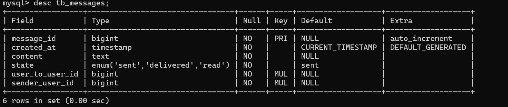

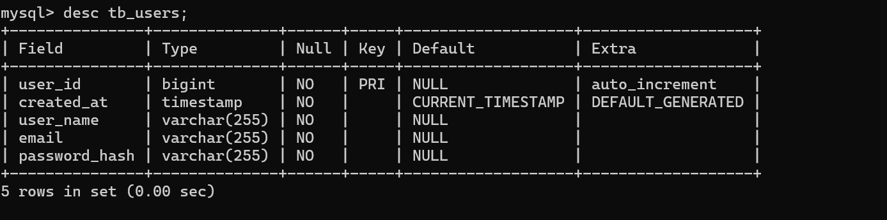

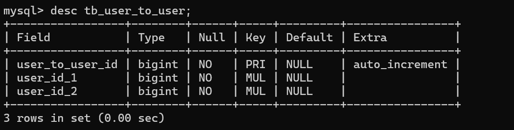

简述一下表结构：
- tb_messages表：消息表，存储消息。其中，userToUserId是外键，指向tb_user_to_user表的user_to_user_id。
- tb_user_to_user表：用户关系表，存储用户与用户之间的关系。其中,userId_1和userId_2是外键，指向tb_users表的user_id。两者顺序可以是随机的。因为在及时通信软件中，发消息的人和收消息的人是没有先后顺序的。
- tb_users表：用户表，存储用户信息。其中，createdAt是用户创建时间戳。

**注意：所有表的外键属性都要设置为`CASCADE`！！！不然进行修改会造成外键冲突！！！**
#### 5.1.1 创建实体类

创建三个实体类：`Messages`、`UserToUser`、`Users`。放在model包下。

> `Messages`实体类
```java
package cn.programcx.springbootinit.model;

import lombok.AllArgsConstructor;
import lombok.Getter;
import lombok.NoArgsConstructor;
import lombok.Setter;

import javax.persistence.*;
import java.sql.Timestamp;

@Entity
@Table(name = "tb_messages")
@Getter
@Setter
@NoArgsConstructor
@AllArgsConstructor
public class Messages {

    @Id
    @Column(name = "message_id")
    @GeneratedValue(strategy = GenerationType.IDENTITY) //自增
    private Long id;

    @Column(name = "created_at",nullable = false,updatable = false)
    private Timestamp time;

    @Column(name = "content",columnDefinition = "TEXT",nullable = false) //声明为TEXT类型
    private String content;

    @Enumerated(EnumType.STRING) //声明为枚举类型
    @Column(name = "state",nullable = false)
    private State state = State.sent;

    @ManyToOne
    @JoinColumn(name = "user_to_user_id", nullable = false)
    private UserToUser userToUser;


    @PrePersist //保存前执行
    protected void onCreate() {
        time = new Timestamp(System.currentTimeMillis()); //设置时间戳
    }

    public enum State {
        sent,delivered,read
    }

    @Override
    public String toString() {
        return "Messages{" +
                "id=" + id +
                ", time=" + time +
                ", content='" + content + '\'' +
                ", state=" + state +
                ", sender=" + sender +
                ", userToUser=" + userToUser +
                '}';
    }
}

```
> `UserToUser`实体类
```java
package cn.programcx.springbootinit.model;

import lombok.AllArgsConstructor;
import lombok.Getter;
import lombok.NoArgsConstructor;
import lombok.Setter;

import javax.persistence.*;

@Entity
@Getter
@Setter
@NoArgsConstructor
@AllArgsConstructor
@Table(name = "tb_user_to_user")
public class UserToUser {

    @Id
    @Column(name = "user_to_user_id")
    @GeneratedValue(strategy = GenerationType.IDENTITY)
    private Long id;

    @ManyToOne
    @JoinColumn(name = "user_id_1", nullable = false)
    private Users user1;

    @ManyToOne
    @JoinColumn(name = "user_id_2", nullable = false)
    private Users user2;
}

```
> `Users`实体类
```java
package cn.programcx.springbootinit.model;

import lombok.AllArgsConstructor;
import lombok.Getter;
import lombok.NoArgsConstructor;
import lombok.Setter;

import javax.persistence.*;
import java.sql.Timestamp;
import java.util.Set;

@Entity
@Getter
@Setter
@NoArgsConstructor
@AllArgsConstructor
@Table(name = "tb_users")
public class Users {

    @Id
    @Column(name = "user_id",nullable = false)
    @GeneratedValue(strategy = GenerationType.IDENTITY)
    private Long id;

    @Column(name = "created_at",updatable = false,nullable = false)
    private Timestamp time;

    @Column(name = "user_name",nullable = false)
    private String userName;

    @Column(name = "email",nullable = false)
    private String email;

    @Column(name = "password_hash",nullable = false)
    private String passwordHash;

    @PrePersist
    void setTime(){
        this.time = new Timestamp(System.currentTimeMillis());
    }

    @Override
    public String toString() {
        return "Users{" +
                "id=" + id +
                ", time=" + time +
                ", userName='" + userName + '\'' +
                ", email='" + email + '\'' +
                ", passwordHash='" + passwordHash + '\'' +
                '}';
    }
}

```
#### 5.1.2 创建Repository

创建三个Repository接口：`MessagesDao`、`UserToUserDao`、`UsersDao`。放在dao包下。

> `MessagesDao`接口
```java
package cn.programcx.springbootinit.dao;

import cn.programcx.springbootinit.model.Messages;
import org.springframework.data.jpa.repository.JpaRepository;

public interface MessagesDao extends JpaRepository<Messages, Long> {
}

```

> `UserToUserDao`接口
```java
package cn.programcx.springbootinit.dao;

import cn.programcx.springbootinit.model.UserToUser;
import org.springframework.data.jpa.repository.JpaRepository;
import org.springframework.data.jpa.repository.Modifying;
import org.springframework.data.jpa.repository.Query;
import org.springframework.transaction.annotation.Transactional;

public interface UserToUserDao extends JpaRepository<UserToUser, Long> {
    //自定义SQL语句，用于插入数据，如果已经存在则忽略
    @Modifying
    @Transactional
    @Query(value = "INSERT IGNORE INTO tb_user_to_user (user_id_1, user_id_2) VALUES (?1, ?2)", nativeQuery = true)
    void insertIgnore(Long userId1, Long userId2);
}

```

> `UsersDao`接口
```java
package cn.programcx.springbootinit.dao;

import cn.programcx.springbootinit.model.Users;
import org.springframework.data.jpa.repository.JpaRepository;

public interface UsersDao extends JpaRepository<Users, Long> {
}

```

#### 5.1.3 测试

##### 5.1.3.1 设置自增基数

执行以下SQL语句，设置自增基数。

```sql
ALTER TABLE tb_messages AUTO_INCREMENT = 1;
ALTER TABLE tb_user_to_user AUTO_INCREMENT = 1;
ALTER TABLE tb_users AUTO_INCREMENT = 1;
```

##### 5.1.3.2 准备数据

在MySQL中执行以下SQL语句，准备数据。

```sql
INSERT INTO tb_users (user_id, user_name, email, password_hash) VALUES (1, 'ProgramCX', '2860245799@qq.com','dfa423sfasf342arf');
INSERT INTO tb_users (user_id, user_name, email, password_hash) VALUES (2, 'ChengXu', 'admin@programcx.cn','da3ssafq12323farf');
```

##### 5.1.3.3 编写测试类

创建一个测试类
```java
package cn.programcx.springbootinit;
import cn.programcx.springbootinit.dao.MessagesDao;
import cn.programcx.springbootinit.dao.UserToUserDao;
import cn.programcx.springbootinit.dao.UsersDao;
import cn.programcx.springbootinit.model.Messages;
import cn.programcx.springbootinit.model.UserToUser;
import cn.programcx.springbootinit.model.Users;
import org.junit.jupiter.api.Test;
import org.springframework.beans.factory.annotation.Autowired;
import org.springframework.boot.test.context.SpringBootTest;
import org.springframework.core.annotation.Order;
import org.springframework.data.domain.Example;

import java.util.List;

@SpringBootTest(webEnvironment = SpringBootTest.WebEnvironment.RANDOM_PORT)
class SpringBootInitApplicationTests {
    @Autowired
    private UsersDao usersDao;
    @Autowired
    private UserToUserDao userToUserDao;
    @Autowired
    private MessagesDao messagesDao;

    @Test
    @Order(1)
    void createAccount1(){
        Users users = new Users();
        users.setUserName("Program");
        users.setEmail("noreply@programcx.cn");
        users.setPasswordHash("124aefr8rgtg");
        users.setId(1L);
        usersDao.save(users);
    }

    @Test
    @Order(2)
    void createAccount2(){
        Users users = new Users();
        users.setUserName("ChengXu");
        users.setEmail("admin@programcx.cn");
        users.setPasswordHash("12aw3ae3sf4tg");
        users.setId(2L);
        usersDao.save(users);
    }

    @Test
    @Order(3)
    void findAccountById() {
        try {
            Users users = usersDao.findById(1L).get();
            System.out.println(users);
        }
        catch (Exception e) {
            System.out.println("User not found.");
        }
    }

    @Test
    @Order(4)
    void findAccountByName(){
        Users example  = new Users();
        example.setUserName("Program");
        List<Users> usersList = usersDao.findAll(Example.of(example));
        for (Users users : usersList) {
            System.out.println(users);
        }
    }

    @Test
    @Order(5)
    void addMessages(){
        Users users = usersDao.findById(1L).get();
        Users users2 = usersDao.findById(2L).get();

        userToUserDao.insertIgnore(users.getId(),users2.getId());

        UserToUser example = new UserToUser();
        example.setUser1(users);
        example.setUser2(users2);

        UserToUser userToUser = userToUserDao.findOne(Example.of(example)).get();

        Messages messages = new Messages();

        messages.setUserToUser(userToUser);
        messages.setContent("Hello, World!");
        messages.setState(Messages.State.sent);
        messages.setSender(users);
        messagesDao.save(messages);
    }

    @Test
    @Order(6)
    void findMessages(){
        Users users = usersDao.findById(1L).get();
        Users users2 = usersDao.findById(2L).get();

        UserToUser example = new UserToUser();
        example.setUser1(users);
        example.setUser2(users2);

        UserToUser userToUser = userToUserDao.findOne(Example.of(example)).get();

        Messages example2 = new Messages();
        example2.setUserToUser(userToUser);

        List<Messages> messagesList = messagesDao.findAll(Example.of(example2));
        for (Messages messages : messagesList) {
            System.out.println(messages);
        }
    }

    @Test
    @Order(7)
    void deleteMessages(){
        Users users = usersDao.findById(1L).get();
        Users users2 = usersDao.findById(2L).get();

        UserToUser example = new UserToUser();
        example.setUser1(users);
        example.setUser2(users2);

        UserToUser userToUser = userToUserDao.findOne(Example.of(example)).get();

        Messages example2 = new Messages();
        example2.setUserToUser(userToUser);

        List<Messages> messagesList = messagesDao.findAll(Example.of(example2));
        messagesDao.deleteAll(messagesList);
    }

    @Test
    @Order(8)
    void updateAccount() {
        Users users = usersDao.findById(1L).get();
        users.setEmail("2860245799@qq.com");
        users.setId(1L);
        usersDao.save(users);
    }

    @Test
    @Order(9)
    void deleteAccount() {
        usersDao.deleteById(1L);
    }

}

```

#### 5.1.4 测试结果

依次执行测试方法，查看结果。

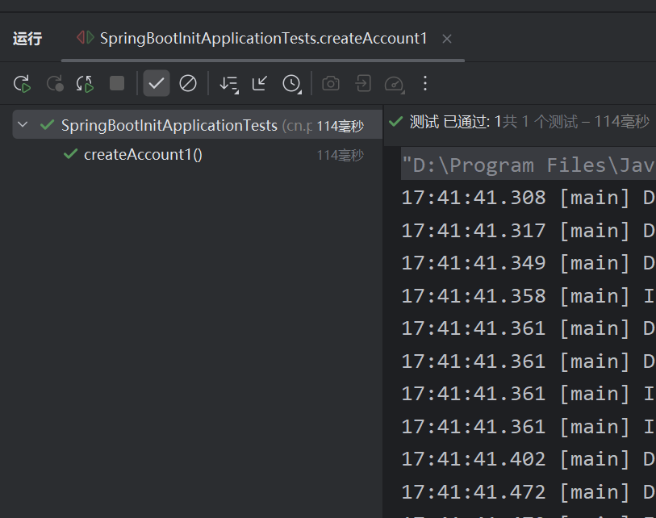

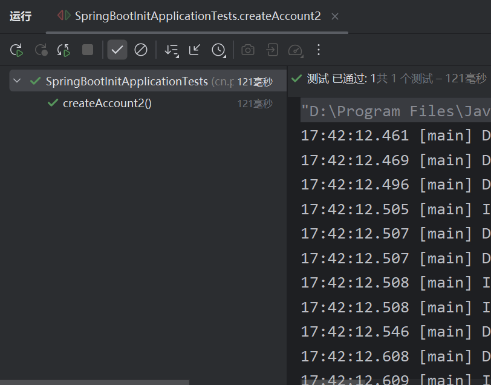

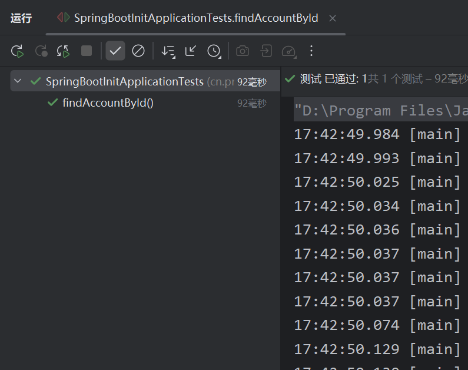

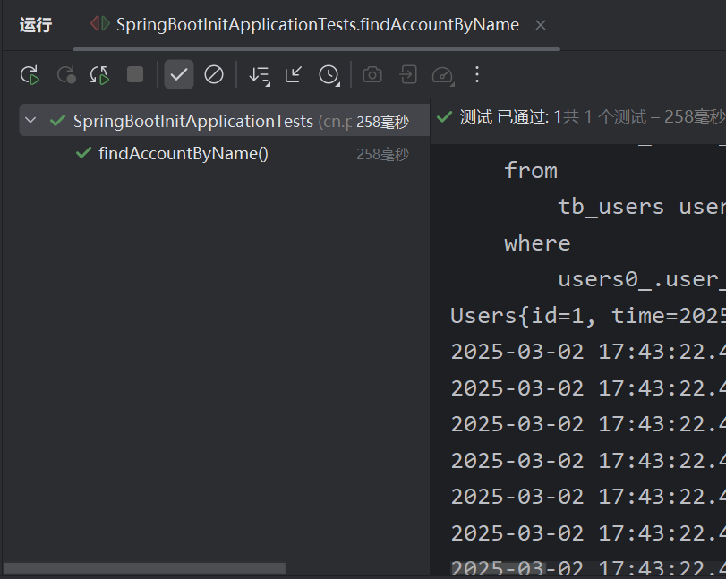

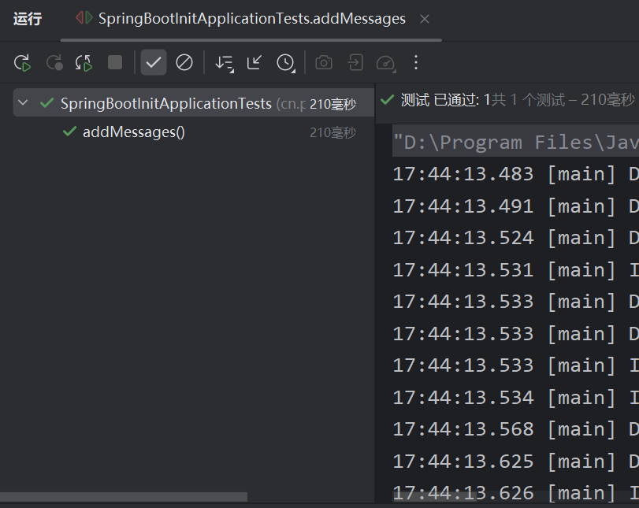

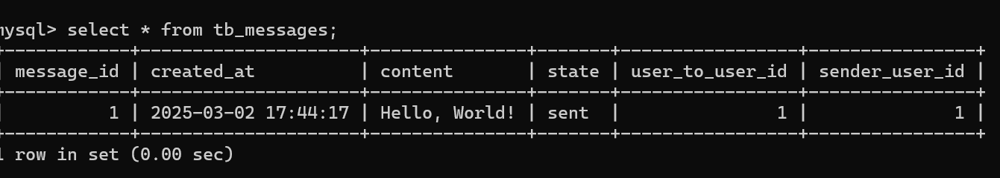

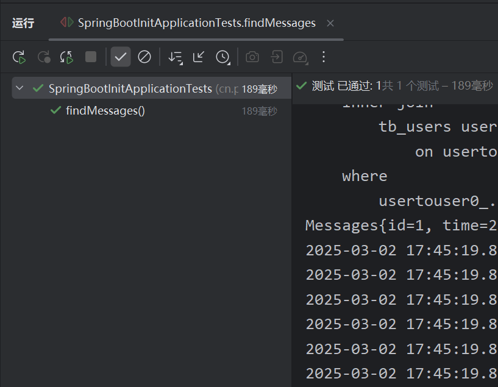

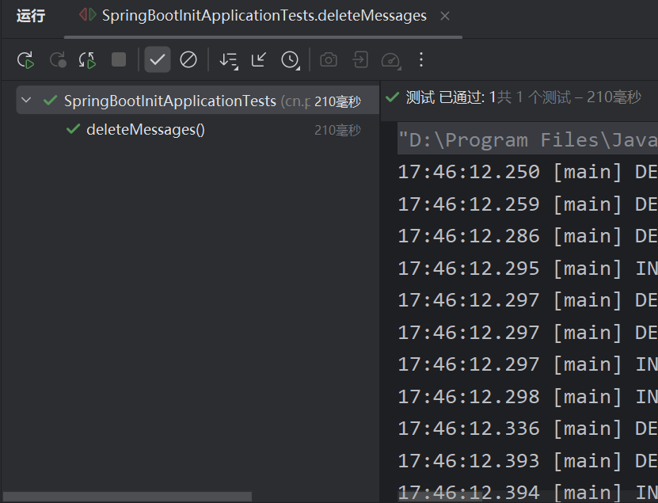

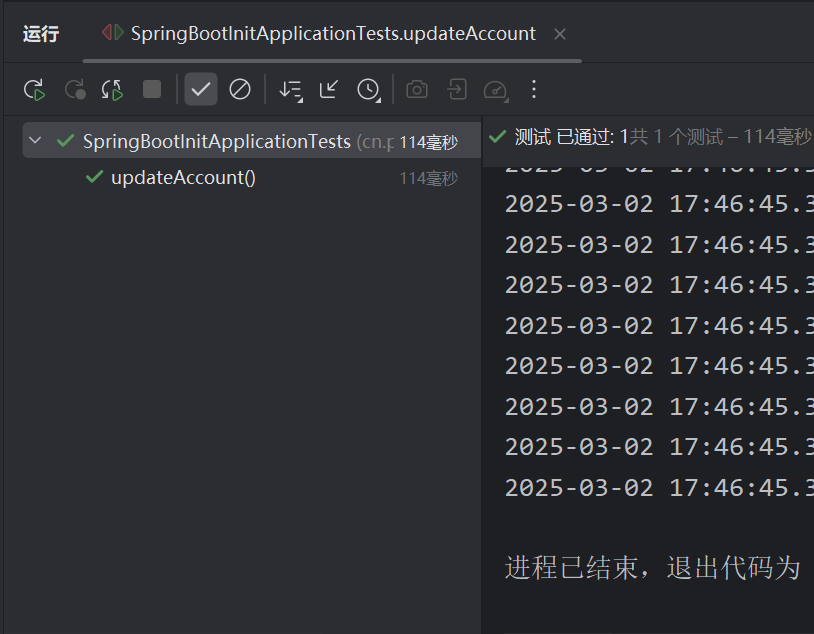

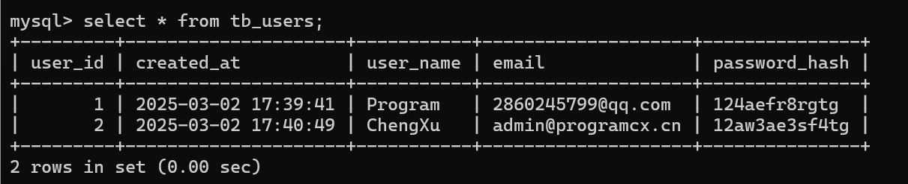

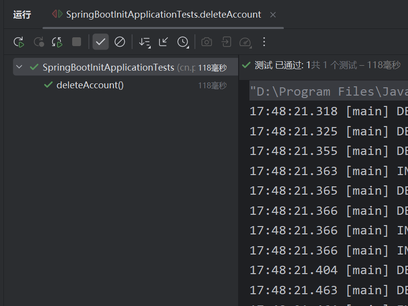

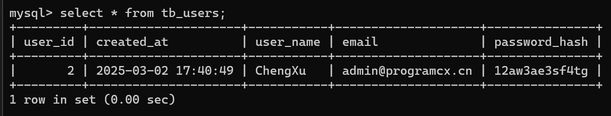

## 6.使用@Query自定义查询

我们可以使用`@Query`注解自定义查询，这样可以更灵活地查询数据。`@Query`可以在分页查询时提高查询效率。

`@Query`注解的属性：
- `value`：查询语句
- `nativeQuery`：是否使用原生SQL
- `countQuery`：在分页查询时，指定查询总数
- `name`: 使用分页查询时，指定查询名称
- `hints`：查询提示

### 6.1 创建Repository

创建一个`MessagesDao`接口，继承`JpaRepository`接口，添加一个自定义查询方法。

```java

package cn.programcx.springbootinit.dao;

import cn.programcx.springbootinit.model.Messages;
import org.springframework.data.jpa.repository.JpaRepository;
import org.springframework.data.jpa.repository.Query;

public interface MessagesDao extends JpaRepository<Messages, Long> {

    @Query(value = "SELECT * FROM tb_messages WHERE content = ?1 and user_to_user_id = ?2 ORDER BY created_at DESC LIMIT 1", nativeQuery = true)
    Messages findLastMessageByContent(String content, Long userToUserId);
}

```

### 6.2 测试

创建一个测试类，测试自定义查询方法。

```java

package cn.programcx.springbootinit;

import cn.programcx.springbootinit.dao.MessagesDao;

import cn.programcx.springbootinit.model.Messages;

import cn.programcx.springbootinit.model.UserToUser;

import cn.programcx.springbootinit.model.Users;

import cn.programcx.springbootinit.dao.UserToUserDao;

import org.junit.jupiter.api.Test;

import org.springframework.beans.factory.annotation.Autowired;

import org.springframework.boot.test.context.SpringBootTest;

import java.util.List;

@SpringBootTest(webEnvironment = SpringBootTest.WebEnvironment.RANDOM_PORT)

class SpringBootInitApplicationTests {

    @Autowired

    private MessagesDao messagesDao;

    @Test
    void findLastMessageByQueryAnnotation(){
        Users users = usersDao.findById(1L).get();
        Users users2 = usersDao.findById(2L).get();

        UserToUser example = new UserToUser();
        example.setUser1(users);
        example.setUser2(users2);

        UserToUser userToUser = userToUserDao.findOne(Example.of(example)).orElse(null);
        Messages messagesList = null;
        if (userToUser != null) {
            messagesList = messagesDao.findLastMessageByContent("Hello, World!", userToUser.getId());
        }

        UserToUser example2 = new UserToUser();
        example2.setUser1(users2);
        example2.setUser2(users);

        UserToUser userToUser2 = userToUserDao.findOne(Example.of(example2)).orElse(null);
        if (userToUser2 != null) {
            messagesList = messagesDao.findLastMessageByContent("Hello, World!", userToUser2.getId());
        }

        if (messagesList != null) {
            System.out.println(messagesList);
        }
    }

}

```

### 6.3 测试结果

执行测试方法，查看结果。

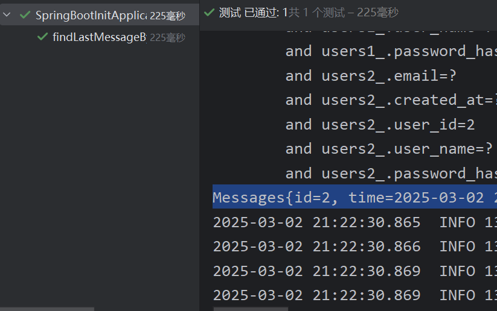

该文章为本人学习笔记，如有错误，欢迍指正。谢谢！

本人个人博客上该文章的链接：https://www.programcx.cn/p/spingboot-jpa/
