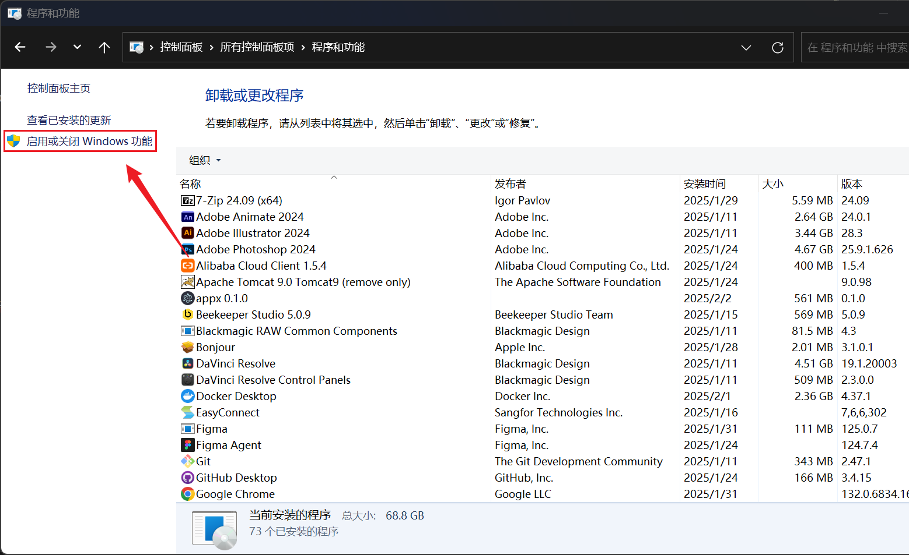
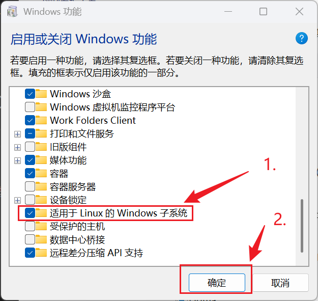
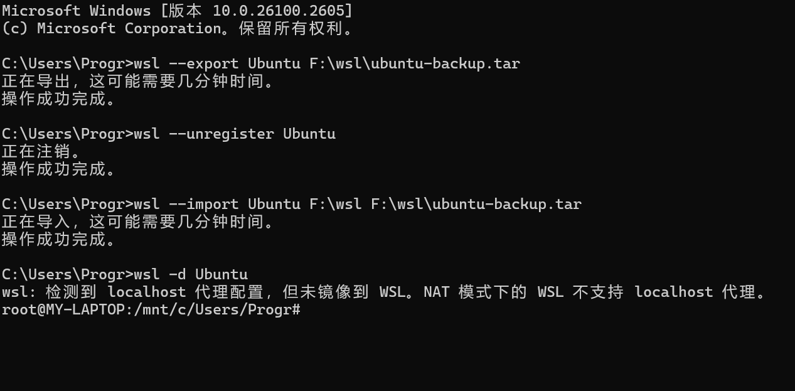

## 一、启用Windows Subsystem for Linux
在Windows 10 21H2或更高版本上，启用Windows Subsystem for Linux。
1. 打开控制面板。
2. 选择“程序和功能”。

3. 选择“启用或关闭Windows功能”。

4. 勾选“适用于Linux的Windows子系统”。

5. 重新启动计算机。

## 二、安装Ubuntu 22.04
重新启动后，会弹出一个提示更新的窗口，按Enter键等待更新完成。

1.打开PowerShell，输入以下命令安装Ubuntu 22.04：
```shell
wsl --set-default-version 2
wsl --install -d Ubuntu
```
2.等待安装完成，按照提示设置用户名和密码。

3.此时，默认安装位置为C盘，可以按照以下步骤安装到其它盘：
```shell
wsl --export Ubuntu F:\wsl\ubuntu-backup.tar # 导出Ubuntu备份
wsl --unregister Ubuntu # 注销Ubuntu
wsl --import Ubuntu F:\wsl\ubuntu F:\wsl\ubuntu-backup.tar --version 2 # 导入Ubuntu
```
4.安装完成后，输入以下命令启动Ubuntu：
```shell
wsl -d Ubuntu
```

5.输入以下命令更新软件包：
```shell
sudo apt update
sudo apt upgrade
```
6.至此，Ubuntu 22.04安装完成。


记录一下，以后有需要可以参考。

